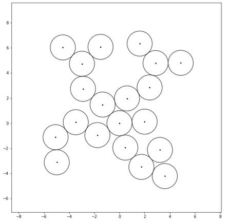
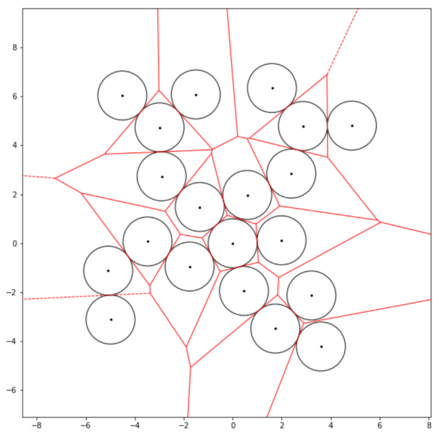
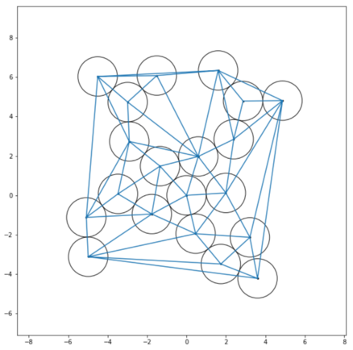
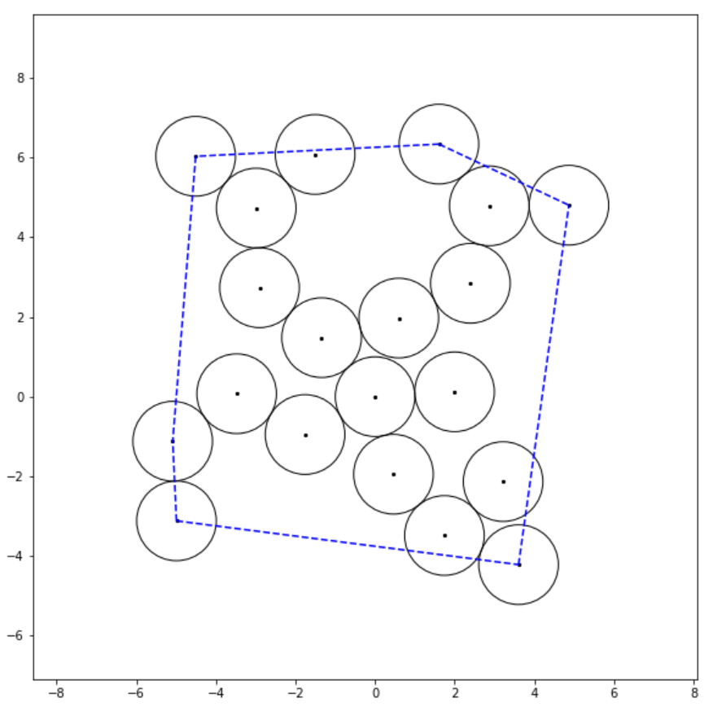

# Cavities in a 2D molecular model

The main goal of this exercise is playing with geometric concepts such as Voronoi tesselations,
Delaunay triangulations, alpha-spheres and alpha-shapes, and their use to obtain the surface,
cavities and grooves of a two dimensional molecular model.

## Tasks

In a single jupyter lab, solve the following tasks in order.

### Random 2D molecular model

Build a random compact 2D molecule with $N$ hard discs of the same radius. "Hard" means here that
discs can not be overlapped in space, and "compact" means that every disc is in contact with one or
more discs. Once you have the spatial 2D coordinates of the $N$ discs, make a plot similar to the following:

### Voronoi diagrams

Given a random 2D molecular model, get the Voronoi diagram produced with the centers of the discs
and show the Voronoi tessellation in a plot similar to this:

### Delaunay triangulation

Get the Delaunay triangles defined by the same coordinates of your random molecular model. Show the
triangles in the 2D space in a figure such as:

You can also try to represent the Voronoi diagram and the Delaunay triangulation in the same plot

### Convex Hull

¿What's the convex hull of you 2D molecular model? ¿Could you show it as a continuous dashed blue
line similar to the following?

### To be continued...

Getting the alpha-spheres of our 2d random molecular model will be the next step.

